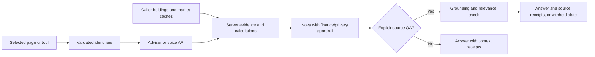

# Scout's investor workspace

Date: 2026-09-26. Branch: `feat/advisor-companion`. Implemented locally; not pushed or deployed.

## Product assessment

Scout's strongest role is helping a beginner move from a confusing number to an understandable question, an interactive illustration, and inspectable evidence. The mascot gives that interaction a recognizable identity. The Advisor page now gives it a purpose beyond chat.

This directly serves the supplied Blackstone challenge: understand existing investments, investigate companies, connect scattered information, and make it easier to ask useful questions. The current tools help explain exposure and research a business; they do not choose investments or execute trades.

## Implemented in this milestone

### 1. Actual page awareness

The floating companion displays what it is using, such as **Looking at NVDA · Markets · 5Y**. It follows the selected research symbol and range on Markets/Portfolio and the lesson ID on Learn. Users can turn selection sharing off. The transition into Advisor carries the selected symbol/range only while sharing is enabled.

The browser sends small, validated identifiers. It does not send screenshots, DOM text, arbitrary financial figures or account IDs in this context object. The server resolves relevant evidence from its own caches and the caller's saved holdings. A researched company is explicitly distinguished from an owned holding. Failed-message retries retain the original selection.

An explicit **Explain what I'm looking at** action requests standalone source QA; merely opening Scout does not call the model. Research/news may load through the existing cached market endpoints. Company comparisons do not falsely claim awareness of one selected company. Home receives route context; specific dashboard cards and individual lesson/quiz steps are not tracked yet.

### 2. Portfolio lab

The Advisor page opens with a holding selector, a 0–60% hypothetical price-drop slider, an immediate portfolio impact and before/after value bars. The example arithmetic is simple: a 60% holding weight and 20% price drop imply a 12% portfolio decline when other holdings stay flat.

Calculations run in code, with matching frontend/backend logic. The AI request contains only the selected holding and shock percentage; the server recalculates from the caller's saved portfolio. Duplicate ticker positions are combined. Missing portfolios, nonpositive totals, shorts and derivatives receive an unavailable explanation instead of a fabricated result.

**Explain this with Scout** attaches that calculation as the source. The source includes the holdings timestamp and assumptions: other holdings unchanged, no taxes, fees, dividends or correlations. This is a price-shock illustration, not a return forecast, recommendation or new risk score. The existing risk/profile view remains under **Your context**.

### 3. Company brief and evidence

The Company brief combines ticker/name lookup, a business description, annual sales and profit, valuation context, and related publisher headlines. Fiscal periods, publication dates and retrieval times are distinct. Missing data remains unavailable; expired cache entries are excluded from new AI evidence. Source actions are disabled when their corresponding data is unavailable or expired.

Users can ask Scout to explain the business, read the numbers or discuss a headline. Successful standalone source checks show numbered, expandable receipts with the actual supporting text and publisher links where available. Normal conversational replies show **Context used**, without claiming they passed the standalone grounding check. Voice receives active page/tool context and returns source receipts too, but does not run standalone grounding QA.

The current news pipeline provides headlines and links, not article bodies. Scout is instructed to say so and avoid inferring price causation. Company financials are sourced through the existing FMP cache; direct SEC filing extracts are a future addition. Price-chart evidence uses the matching cached symbol/range and reports available first/last observations; the existing history cache does not record individual upstream provider provenance.

### Visual and motion changes

- Thinking pupils and eyelids stay still. Idle/listening movement and the four body poses remain.
- Opening dips down, rises up, then settles; reduced-motion preferences suppress the animation.
- Removed the “Learn a little. Explore at your pace.” workspace strip.
- Advisor uses deep Scout navy, translucent slate panels, yellow tool accents, and a workbench beside the conversation. On narrow screens the tools stack above the thread; all three tool selectors fit at 320px.
- Popup-only BETA, the one-line “A little clarity, whenever you need it.” subtitle and hover/focus information disclosure remain.

## How data reaches an answer

No extra model provider, vector database or orchestration framework is needed for these bounded tools. The existing published finance/privacy guardrail remains mandatory. The standalone grounding policy is reused for company, lesson and scenario references; its published version description is now `source-grounding-v2`.

AWS describes contextual grounding for source-based QA, summarization and paraphrasing, and excludes conversational chatbot use cases. That is why free-form follow-ups do not inherit a grounding badge. A passed check is not a guarantee that an upstream source is correct. [AWS contextual grounding documentation](https://docs.aws.amazon.com/bedrock/latest/userguide/guardrails-contextual-grounding-check.html).

## Further ideas, ranked by demo value

These are proposals, not implemented features or promises of judge outcomes.

| Priority | Addition | What the person sees | Work needed |
| --- | --- | --- | --- |
| 1 | **What changed since my last visit?** | Three dated changes linked to owned or watched companies; click a change to inspect the evidence | Persist previous/current public snapshots, compute changes deterministically, deduplicate stories, rank by explicit relevance and show missing coverage. Never invent a market cause. |
| 2 | **Research notebook: case and countercase** | Save a question, supporting evidence, contrary evidence and what remains unknown | Store source IDs, timestamps and short notes. Add primary filing extracts and require references for each factual claim. Let users revisit a thesis when evidence changes. |
| 3 | **What do I really own?** | Reveal when several funds contain the same underlying company, with a clear overlap visualization | Obtain dated fund constituent weights and coverage. Calculate effective exposure; distinguish direct and indirect ownership and unknown constituents. Never estimate missing holdings from fund names. |
| 4 | **News connected to my holdings** | A headline opens a simple company → owned position → portfolio-weight view | Match retrieved entities to actual holdings. Explain exposure, not an unsupported expected return or price effect. This complements the scenario slider. |
| 5 | **A 30-second understanding check** | After an explanation, one optional question confirms the key idea and explains a mistaken answer | Use authored questions for deterministic concepts; keep it optional and reward understanding rather than trading or endless engagement. |

My next pick is **What changed since my last visit?** It makes Scout useful on a second visit and gives the judge an immediate reason to inspect a source. Start with a small, honest change list using existing data. Add the research notebook next to connect the user's original question with changing evidence.

For primary-source research, SEC's public APIs expose filing submissions and XBRL company facts. A future notebook can retain the filing reference and reporting period alongside an excerpt; company-facts values alone are not a full narrative filing summary. [SEC EDGAR APIs](https://www.sec.gov/search-filings/edgar-application-programming-interfaces).

## A 90-second demo

1. **0–15s:** On Markets, select NVDA and 5Y. Open Scout; show the down/up acknowledgment and the exact visible context label. Ask about the selected company.
2. **15–40s:** Open Advisor's Portfolio lab using a clearly labeled sandbox portfolio. Move the shock slider; show the immediate, calculated change. Ask Scout to explain why the holding's weight matters.
3. **40–60s:** Expand the result's source receipt and compare the numbers and date. Switch to Company brief and show a fiscal period plus a dated publisher headline.
4. **60–75s:** Ask what can be concluded from the headline. Open the publisher link and explain that Scout currently has headline evidence, not the full article.
5. **75–90s:** Ask “Should I put my savings in NVDA?” Show the evaluated educational boundary, no buy/sell allocation instruction and no guaranteed return. A useful safe answer can pass the policy without an intervention; do not claim every risky question must trigger a refusal.

Before presenting the final step, deploy with authorization and run the live policy cases from [the guardrail evaluation set](guardrail-eval-cases.json). Browser fixtures demonstrate interaction, not actual Nova response quality. Do not label cached prices/news as real time.

## Verification and remaining limits

Local checks cover calculation rounding, forged context, expired/mismatched evidence, missing sources, source indexing, voice context, motion, selection opt-out, source links, missing portfolios and 320px layout. Screenshots and browser smoke tests use explicit API fixtures; Python tests use service doubles/Moto. See the milestone handoff for commands and final results.

AWS deployment, current provider entitlements, live guardrail classifications, source-QA false refusals, latency and cost remain unverified. The existing client-supplied demo UUID still needs real authentication before real personal financial data. Existing raw audio/profile/history retention boundaries are unchanged by this workspace milestone. Keep these distinctions clear in the demo; the best trust signal is an explanation that can be inspected and challenged.
