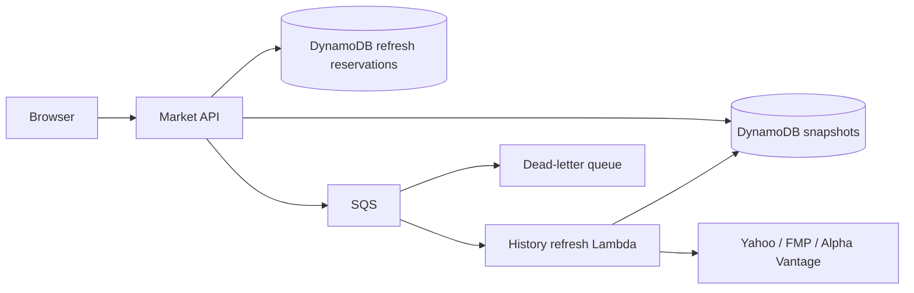

# Market history background refresh

`GET /market/history` reads DynamoDB snapshots and submits work to SQS. It never
calls Yahoo, FMP, or Alpha Vantage during the HTTP request. A separate Lambda
fetches one symbol/range per job and publishes the result. Other market endpoints
(macro, comparisons, research, movers, news, search) retain their existing flows.



## HTTP and browser behavior

- Fresh snapshots: `200`, `refreshing: false`.
- Expired snapshots within seven days of freshness expiry: `200`, `stale: true`,
  `refreshing: true`. The old chart remains visible during refresh.
- Missing snapshots: `202` with the same `History` envelope. `series` contains
  whichever requested symbols are already available; `refresh` describes every
  requested symbol. Duplicate requested symbols are normalized to one result.
- Every `refresh` entry has `symbol`, `status` (`ready`, `pending`, `failed`),
  `fetchedAt`, and `requestedAt`. Dates are ISO timestamps or null. `fetchedAt`
  is retrieval time, not the date of the last price observation.
- Pending responses include `Retry-After: 5`. The browser polls foreground queries
  every five seconds, stopping once ready or two minutes after `requestedAt`.
  Delayed work offers a manual **Check again** action. A failed refresh keeps any
  existing chart; without a usable snapshot and pending work, the API returns 502.
- History responses set `Cache-Control: no-store`; snapshot caching happens in
  DynamoDB and the browser query cache, not a shared HTTP cache.

The new response fields are optional in the contract so existing 200 fixtures and
clients remain valid. Consumers must handle 202 before deploying this backend.
Both the backend and frontend changes belong in the same release.

## Duplicate delivery and failure recovery

A conditional DynamoDB write reserves `REFRESH#history#<symbol>/<range>` with a
unique job token. Concurrent users share the same job. The initial dispatch lease
is 30 seconds: if the producer dies between reservation and sending to SQS,
subsequent requests can recover after that lease expires. Successful sends extend
it to 3,720 seconds (one-hour queue retention plus an in-flight margin).

Workers acquire a separate 90-second execution lease, longer than their 60-second
Lambda deadline. Duplicates cannot fetch concurrently for the same reservation.
A worker that crashes leaves a lease that a later delivery can reclaim. Completing
a job writes the cache snapshot and marks the job complete in one DynamoDB
transaction, conditioned on both reservation and execution tokens. Superseded
workers cannot overwrite a newer snapshot. Completed/obsolete deliveries are no-ops.

Failed records are returned through `ReportBatchItemFailures`. The queue has a
360-second visibility timeout, five receives before redrive, and a 14-day DLQ.
On the final handled failure, the job is marked failed with a five-minute cooldown.
Polling cannot immediately create another failing job. Hard timeouts or failures
before error handling may leave a pending reservation until it expires; the
browser still stops polling after two minutes. Source messages expire after an
hour; snapshots are regenerable and the queue-age alarm flags backlogs earlier.

DynamoDB TTL only cleans up records. Code checks snapshot and lease expiration
explicitly. Old cache entries are usable until seven days after their 24-hour
freshness interval ends; they are not served beyond that cutoff even if TTL has
not deleted them.

## Deployment and operation

1. Apply `infra/cicd-role.yaml` with owner credentials **before** deploying the app.
   It adds permissions for the named refresh queues, worker event-source mapping,
   and refresh alarms. The existing deploy role cannot provision these resources.
2. Merge through a PR with green `ci-ok`; normal CD builds and deploys the backend
   and frontend. No manual production deployment is part of this implementation.
3. Verify a cold symbol/range transitions from 202 to 200. A previously populated
   cache may return 200 immediately. Check the browser's pending and stale states.
4. Observe worker logs (`history refresh queued/completed/failed`), Lambda errors
   and duration, SQS age, and the two CloudWatch alarms. `MarketRefreshQueueUrl` and
   `MarketRefreshDeadLetterQueueUrl` are stack outputs.

The alarms monitor visible DLQ messages and oldest source-message age over five
minutes. They have **no notification actions**; connect them to the team's alert
channel before relying on proactive notifications. Diagnose exhausted jobs before
redriving. A redriven message with an obsolete/completed token is intentionally
ignored; a failed token remains failed. After the cooldown, a new API request
creates a new job, which is the normal recovery path.

The worker is limited to two concurrent invocations, one message per invocation.
This bounds parallelism, **not provider requests per second or daily quotas**.
There is no shared provider quota allocator in this change. Check the actual
provider subscriptions before raising concurrency; use global provider budgets
as a follow-up if demand warrants them. Free-tier fallback limits still apply.

The worker's IAM role can only read/write history cache and refresh reservation
keys, read the FMP/Alpha Vantage SSM parameters, and poll its queue. It cannot read
user/Portfolio rows, audio, or invoke Bedrock. Existing MarketFn permissions are
unchanged apart from queue submission.

## Verification

```bash
pytest -q
ruff check .
sam validate --lint
sam build
npm run typecheck
npm run lint
npm test
npm run build
# Start the preview with its API base set to the contract/mock address:
VITE_API_BASE_URL=http://127.0.0.1:4010 npm run dev -w frontend
# In a second terminal, with Playwright Chromium installed:
npm run test:history-refresh -w frontend
```

The browser script intercepts API responses; no real providers are called. Set
`PLAYWRIGHT_CHROMIUM_EXECUTABLE` to use an installed Chrome-compatible browser and
`CLEARVEST_PREVIEW_URL` to select another local port. Offline backend tests use Moto
for DynamoDB/SQS, mock providers, and cover API-to-worker publication, concurrency,
crash recovery, failed submission, stale retention, partial failure, and fencing.

To compare real impact, measure warm/stale HTTP p95, upstream calls per refresh,
queue age, and snapshot age under concurrent requests. The tests establish that
provider calls have left the request path; they do not establish production latency.
